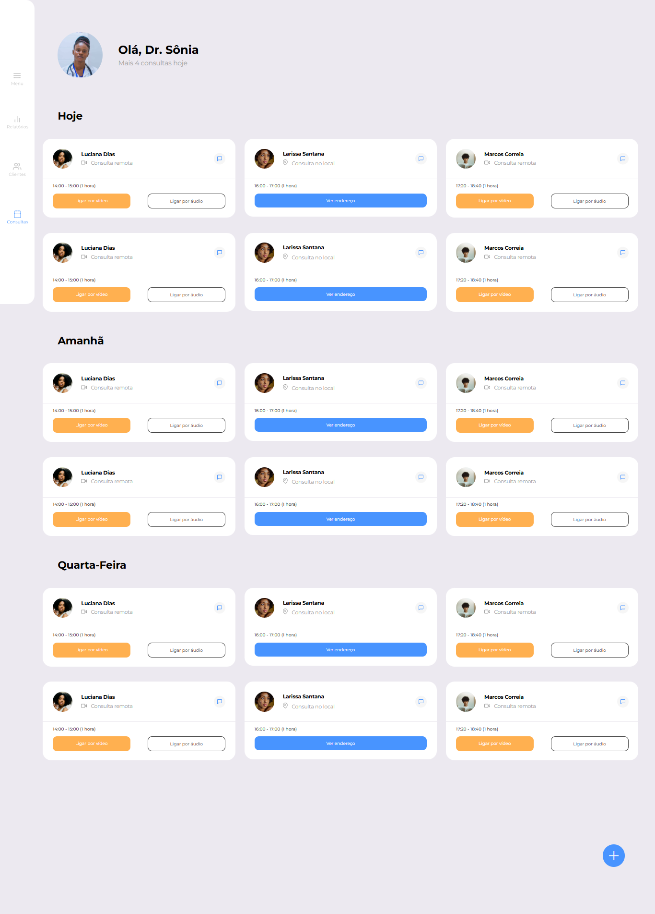

# 🚀 #7DaysOfCode - HTML & CSS - Mobile First

Projeto desenvolvido como parte do desafio **#7DaysOfCode**, proposto pela [Alura](https://www.alura.com.br/).  
O objetivo é praticar e aprimorar habilidades em **HTML5** e **CSS3** durante 7 dias consecutivos, criando um projeto completo para portfólio.

---

## 📌 Sobre o desafio

Durante 7 dias, recebi desafios diários com foco em:

- Estruturação de páginas com **HTML**
- Estilização e boas práticas com **CSS**
- Alinhamentos e espaçamentos
- Uso de **Flexbox** e **Grid Layout**
- Responsividade (Mobile First → Desktop)
- Inserção e organização de imagens/SVG

---

## 📂 Estrutura do projeto

📦 7daysOfCode
┣ 📂 Assets
┣ 📄 index.html
┣ 📄 style.css
┗ 📄 README.md

---

## ⚙️ Tecnologias utilizadas

- **HTML5**
- **CSS3**

---

## 📅 Progresso dos desafios

- [x] Dia 1 - Estrutura inicial e organização de pastas
- [x] Dia 2 - Cabeçalho e lista de consultas (versão Mobile First)
- [x] Dia 3 - Flexbox e alinhamentos
- [x] Dia 4 - Grid layout
- [x] Dia 5 - Componentes visuais e responsividade
- [x] Dia 6 - Ajustes finais de design
- [x] Dia 7 - Revisão e publicação

---

## 🖼️ Prévia do Projeto

## 📢 Como rodar o projeto

Clone este repositório:

bash
git clone https://github.com/EdsonST/7daysOfCode_Mobile.git

cd 7daysOfCode_Mobile

Abra o arquivo index.html no navegador de sua preferência.

✨ Autor

Feito com dedicação durante o #7DaysOfCode 💻
Edson Santos
